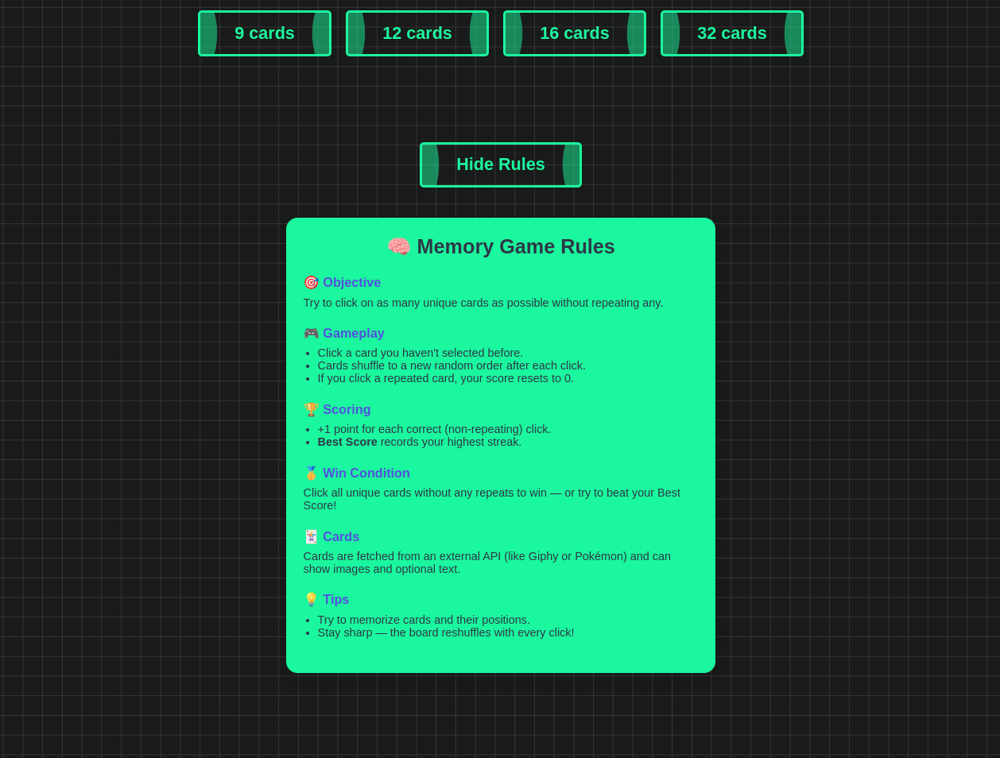
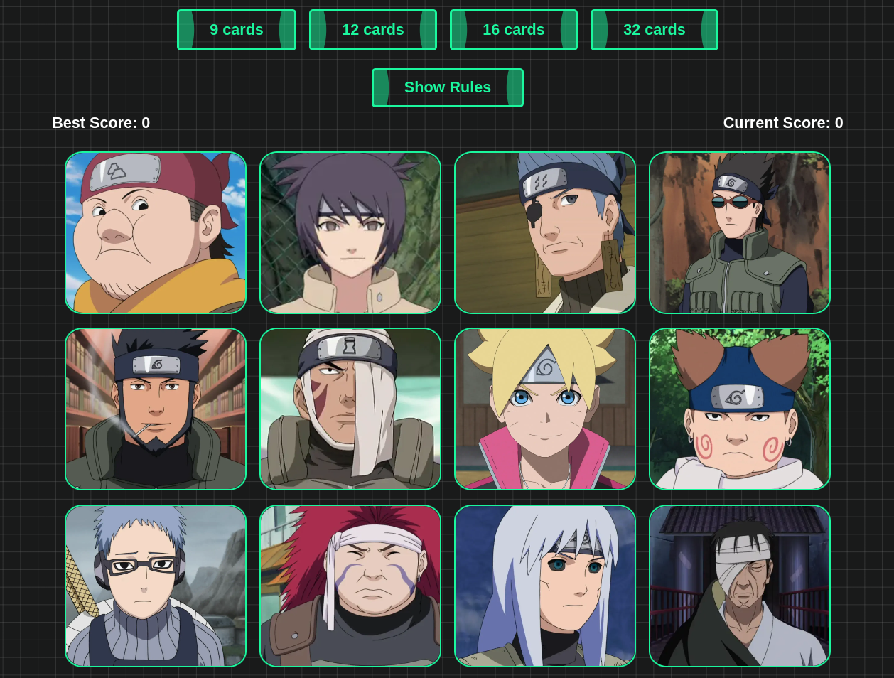

# 🧠 Memory Card Game

**Project from React Course**
  
  


## 🎯 Introduction

Welcome to the **Memory Card Game** project! This app was built to reinforce core React concepts such as:

- State management using `useState`
- Side effects and data fetching with `useEffect`
- Event handling and conditional rendering
- Fetching external data via API
- Dynamic and responsive UI

This project challenges you to apply what you've learned in a fun, interactive way.

---

## 🕹️ How the Game Works

The goal of the game is simple:
- Click on each card **only once**.
- Every time you click a new card, your **score increases**.
- If you click the **same card twice**, you lose and your score resets.
- Your **Best Score** is tracked separately to keep record of your highest achievement.
- Cards are shuffled after each click, keeping the game dynamic and tricky.

---

## 📦 Features

- ✅ React functional components and hooks (`useState`, `useEffect`)
- ✅ Scoreboard: current score and best score
- ✅ Cards fetched from an external API (e.g., Naruto API)
- ✅ Cards shuffle on every click
- ✅ Responsive design
- ✅ Stylish and user-friendly interface
- ✅ Game Over alert with replay option

---

## 🧱 Tech Stack

- **React**
- **JavaScript (ES6+)**
- **HTML5 / CSS3**
- **Fetch API**
- Optional: [SweetAlert2](https://sweetalert2.github.io/) for popups

---

## 🚀 Getting Started

1. **Clone the repository:**
   ```bash
   git clone https://github.com/mkatfi/React-projects/tree/main/Memory-Card
   cd Memory-Card
   ```

2. **Install dependencies:**
   ```bash
   npm install
   ```

3. **Start the development server:**
   ```bash
   npm run dev
   ```

4. **Open in browser:**
   Navigate to `http://localhost:5173` or as instructed by the dev server.

---

Make sure to run:

```bash
npm run build
```

Then follow the deployment guide of your chosen platform.

---

## 📁 Folder Structure

```
memory-card/
│
├── public/               # Static files
├── src/
│   ├── components/  # Reusable components (Cards, Scoreboard, etc.)
│   │    ├── GetImage.jsx
│   │    └── Rules.jsx     
│   ├── App.jsx           # Main app component
│   ├── App.css         # Global styles
│   └── main.jsx          # React DOM renderer
├── package.json
└── README.md
```
---

# React + Vite

This template provides a minimal setup to get React working in Vite with HMR and some ESLint rules.

Currently, two official plugins are available:

- [@vitejs/plugin-react](https://github.com/vitejs/vite-plugin-react/blob/main/packages/plugin-react) uses [Babel](https://babeljs.io/) for Fast Refresh
- [@vitejs/plugin-react-swc](https://github.com/vitejs/vite-plugin-react/blob/main/packages/plugin-react-swc) uses [SWC](https://swc.rs/) for Fast Refresh

## Expanding the ESLint configuration

If you are developing a production application, we recommend using TypeScript with type-aware lint rules enabled. Check out the [TS template](https://github.com/vitejs/vite/tree/main/packages/create-vite/template-react-ts) for information on how to integrate TypeScript and [`typescript-eslint`](https://typescript-eslint.io) in your project.

---

## 📸 Screenshots

_Add screenshots here if you like!_

---

## 🧠 Credits

API used: [Naruto API](https://naruto-api-rsl3.onrender.com/)

---

**Happy Coding 🧠💻**
