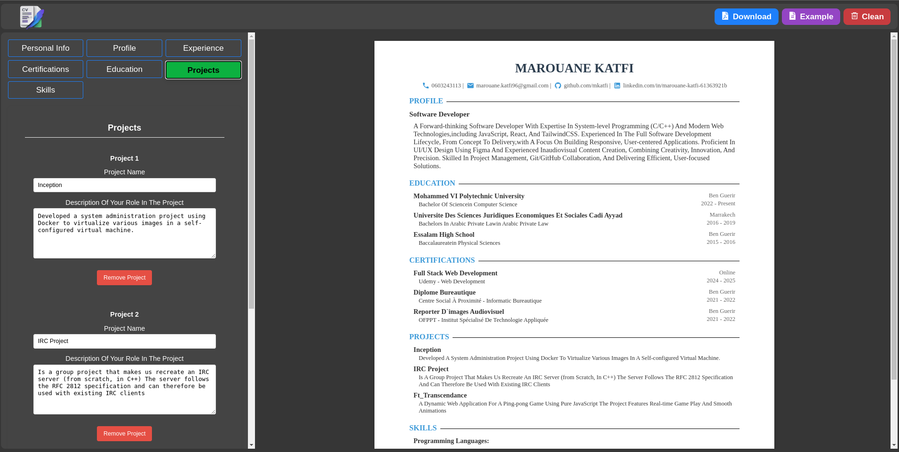

Absolutely! Here's a polished `README.md` based on the assignment description you provided, ideal for your CV Generator React project:

---


# 🧾 CV Generator App

Welcome to your very first React project! This application allows users to input their personal, educational, and practical experience to generate a professional-looking CV.



---

## 📚 Introduction

This project is designed to help you practice core React concepts like:

- Components
- State management
- Props
- Conditional rendering
- Basic styling and structure

It's the perfect project to get hands-on with forms, interactivity, and UI organization.

---

## ✨ Features

- 📋 Input sections for:
  - General Information (name, email, phone)
  - Educational Experience
  - Practical Experience
- 📝 Edit & Submit modes for each section
- 🔁 Form toggle between view and edit state
- 💾 Persistent data during session using state
- 🎨 Custom styling with modular CSS
- ⚡ Fast build system powered by Vite

---

## 🛠️ Getting Started

### 1. Clone the Repository

```bash
git clone https://github.com/mkatfi/React-projects/tree/main/cv-Application
cd cv-Application
```

### 2. Install Dependencies

```bash
npm install
```

### 3. Run the App Locally

```bash
npm run dev
```

The app should now be running at `http://localhost:5173`

---

## 🧱 Project Structure

```
├── public/
│   └── logo.png                  # Static assets
├── src/
│   ├── components/               # React components (GeneralInfo, Education, Experience, etc.)
│   ├── styles/                   # CSS files for styling
│   ├── App.jsx                   # Main component
│   └── main.jsx                  # Entry point
├── index.html
├── package.json
└── vite.config.js
```

---

## 🚀 Deployment Options

Once your app is complete, you can deploy it using any of the following platforms:

### ▶️ Vercel

1. Push your project to GitHub.
2. Go to [vercel.com](https://vercel.com) and log in.
3. Click **"Add New Project"**, select your repo, and hit **"Deploy"**.
4. Vercel automatically detects Vite and sets the correct build settings.

> Build command: `npm run build`  
> Output directory: `dist`

📘 [Vercel Docs](https://vercel.com/docs)

---

## 📌 Future Enhancements

- Add live preview of the CV
- Export to PDF functionality
- Theme toggler (dark/light mode)

---

## 🧑‍💻 Author

Built with ❤️ as part of the [React Curriculum](https://theodinproject.com/).

---

# React + Vite

This template provides a minimal setup to get React working in Vite with HMR and some ESLint rules.

Currently, two official plugins are available:

- [@vitejs/plugin-react](https://github.com/vitejs/vite-plugin-react/blob/main/packages/plugin-react/README.md) uses [Babel](https://babeljs.io/) for Fast Refresh
- [@vitejs/plugin-react-swc](https://github.com/vitejs/vite-plugin-react-swc) uses [SWC](https://swc.rs/) for Fast Refresh

## Expanding the ESLint configuration

If you are developing a production application, we recommend using TypeScript and enable type-aware lint rules. Check out the [TS template](https://github.com/vitejs/vite/tree/main/packages/create-vite/template-react-ts) to integrate TypeScript and [`typescript-eslint`](https://typescript-eslint.io) in your project.
